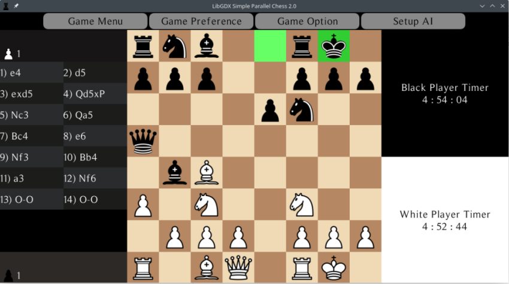

A simple 2 player chess AI that implemented minimax & alpha-beta pruning & move-ordering & pawn structure analysis to fully optimise the AI
It's cross-platform as well, unfortunately it cannot run on web as it is a multithreaded program

NOTE: **Can't create ipa for ios since I am not using macOS...**

## Folder Structure

The workspace contains two folders by default, where:

- `core`: the folder to maintain sources, stores the code for chess engine logic and UI design
- `asset/resource`: the folder that store textures, skin and font for the UI
- `platformExe`: the folder that contains each platform's executable file

## To play the Game

No. | Steps
--- | ----
1.| User can choose to play as white/black
2.| User can choose white/black as AI
3.| Or, user can watch AI play against itself
4.| Once the game started, left click the piece you wish to move, and click the square you wish to place it
5.| User can reset timer if they wish to start a new game

## Game Features

No. | Features
--- | ----
1.| Restart new game
2.| Save game/ Load saved game
3.| Exit to menu screen
4.| Highlight legal moves
5.| Show move history
6.| Choose AI level from 1 to 10
7.| Show captured piece
8.| Undo previous move
9.| Multithreaded feature depends on the number of cores of a pc, the greater the better/faster AI can think
10.| Flip board
11.| Choose 6 different board colors
12.| Pause timer
13.| Show AI thinking progress bar
14.| Show menu and about screen

**Welcome Screen**

**About Screen**

**Game Screen**
